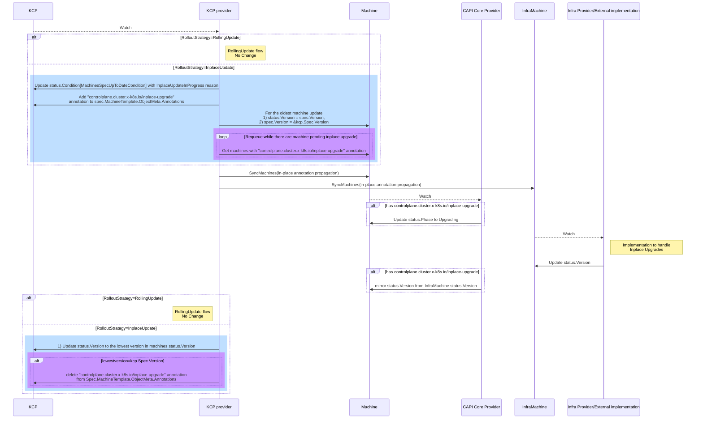
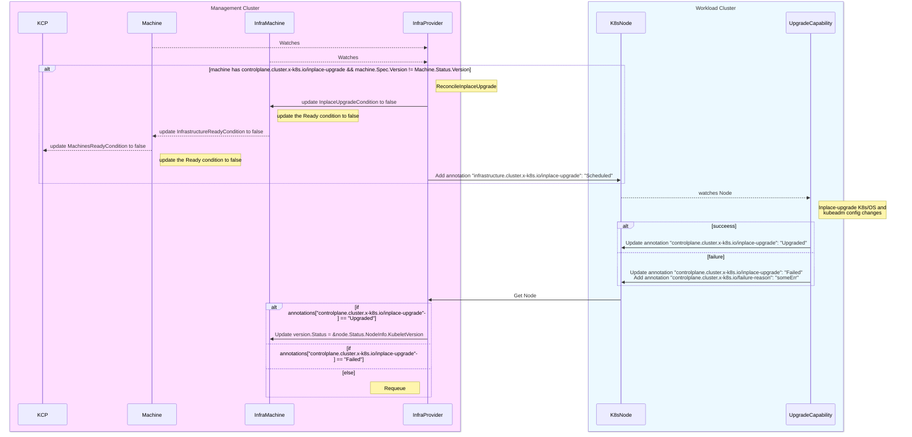

# Bootloading <-> Dracut <-> OSTree
```mermaid
sequenceDiagram
    participant Kernel
    participant Initramfs
    participant RealRootFS
    participant Dracut
    participant OSTree

    Note over Kernel: Linux Kernel Loading

    Initramfs ->> Kernel: Initramfs Loaded
    Kernel ->> Initramfs: Execute /init

    Note over Initramfs: Initramfs Setup and Mount Real Root FS

    Initramfs ->> Dracut: Initramfs Setup
    Dracut ->> Dracut: Execute Dracut Modules
    Dracut ->> Dracut: Generate OSTree Hooks

    Note over Dracut: Dracut Integration with OSTree

    Dracut ->> OSTree: Read OSTree Configuration
    Dracut ->> OSTree: Mount OSTree Root FS
    Dracut ->> OSTree: Run OSTree Hooks

    Note over OSTree: OSTree Module Functions

    OSTree ->> OSTree: Prepare Root (initialize rootfs)


    Note over Dracut: PIVOT ROOT Operation

    RealRootFS -->> Initramfs: Move Initramfs to Subdirectory
    RealRootFS ->> /newroot: Create /newroot Directory
    Initramfs ->> /newroot: Mount Real Root FS

    Note over Initramfs: Init Process Switch to /newroot

    /newroot ->> /newroot: Setup Root FS

    /newroot ->> Init: Execute init Process

    Note over Init: Continue Boot Process on Real Root FS

    Init -->> RealRootFS: Boot Complete
```
# CAPI <-> CAPV sequence diagram

# CAPV <-> Agent sequence diagram
